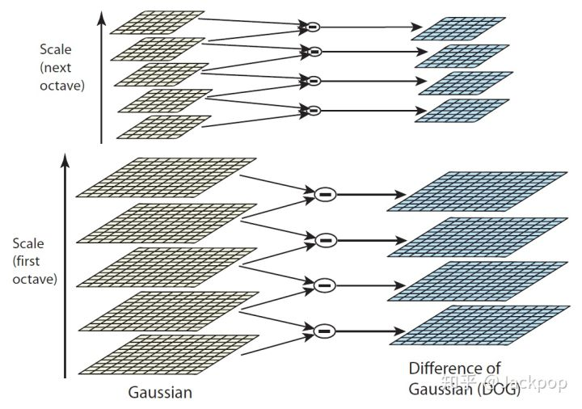

# SIFT算法学习笔记

## 前言
尺度不变特征转换(Scale-invariant feature transform 或 SIFT)是一种机器视觉的算法用来侦测与描述影像中的局部性特征，它在空间尺度中寻找极值点，并提取出其位置、尺度、旋转不变数，此算法由 David Lowe 在1999年所发表，2004年完善总结。 后续的论文中也有许多基于 SIFT 改进的论文，例如 SURF 将 SIFT 的许多过程近似，达到加速的效果；PCA-SIFT利用主成分分析降低描述子的维度，减少内存的使用并加快配对速度。

SIFT算法是一种基于局部兴趣点的算法，不仅对图片的大小和旋转不敏感，而且对光照、噪声等影响的抗击能力也非常优秀。

## SIFT
SIFT算法主要包含4步
* 尺度空间极值检测：通过使用高斯差分函数来计算并搜索所有尺度上的图像位置，用于识别对尺度和方向不变的潜在兴趣点。

* 关键点定位：通过一个拟合精细的模型在每个候选位置上确定位置和尺度，关键点的选择依赖于它们的稳定程度。
* 方向匹配：基于局部图像的梯度方向，为每个关键点位置分配一个或多个方向，后续所有对图像数据的操作都是相对于关键点的方向、尺度和位置进行变换，从而而这些变换提供了不变形。
* 关键点描述：这个和HOG算法有点类似之处，在每个关键点周围的区域内以选定的比例计算局部图像梯度，这些梯度被变换成一种表示，这种表示允许比较大的局部形状的变形和光照变化。

## refrence
* https://zhuanlan.zhihu.com/p/70385018
* https://zh.wikipedia.org/zh-cn/尺度不变特征转换