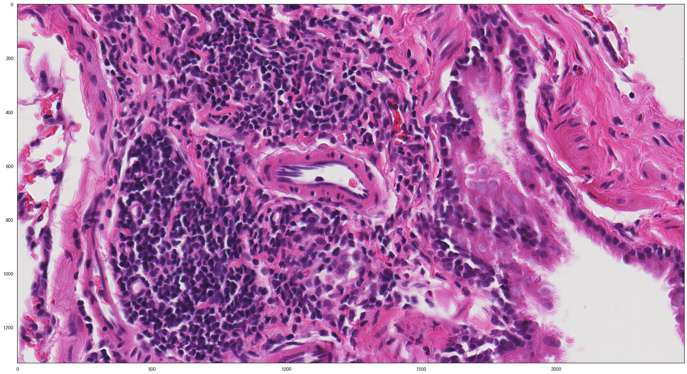
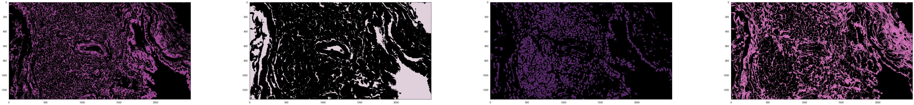
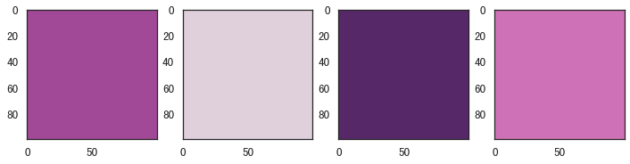
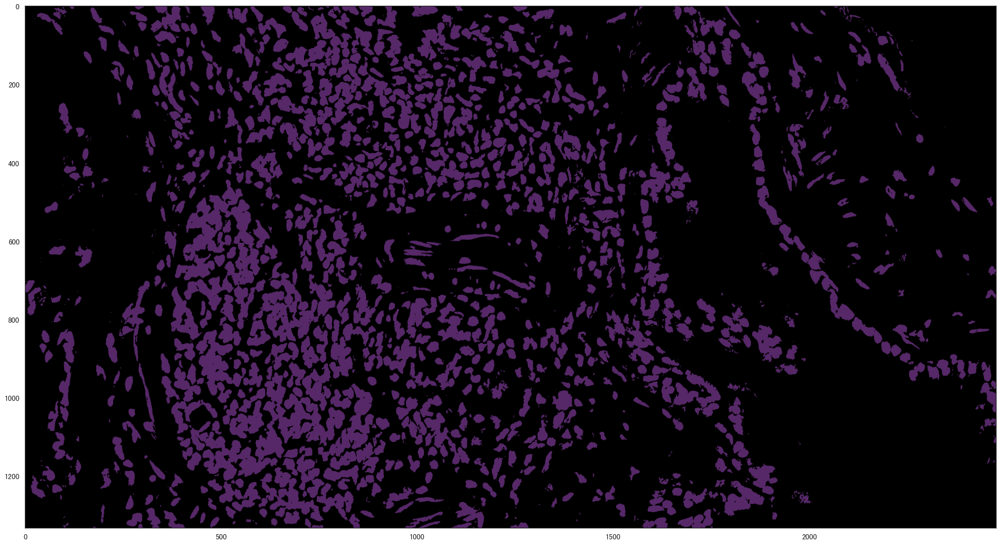
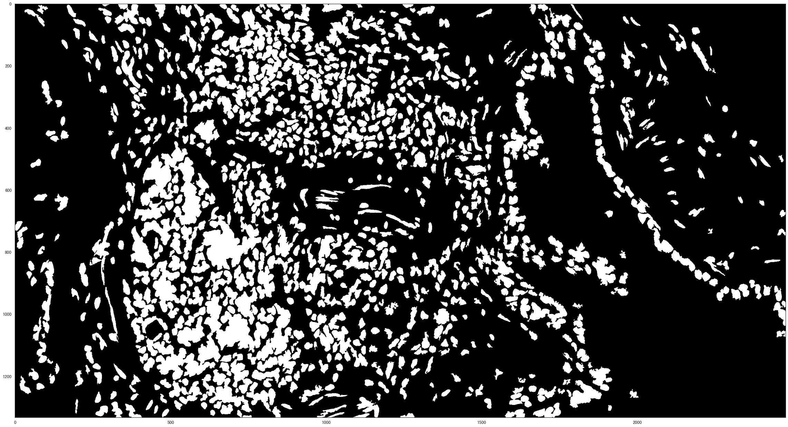
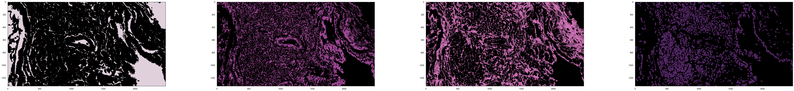
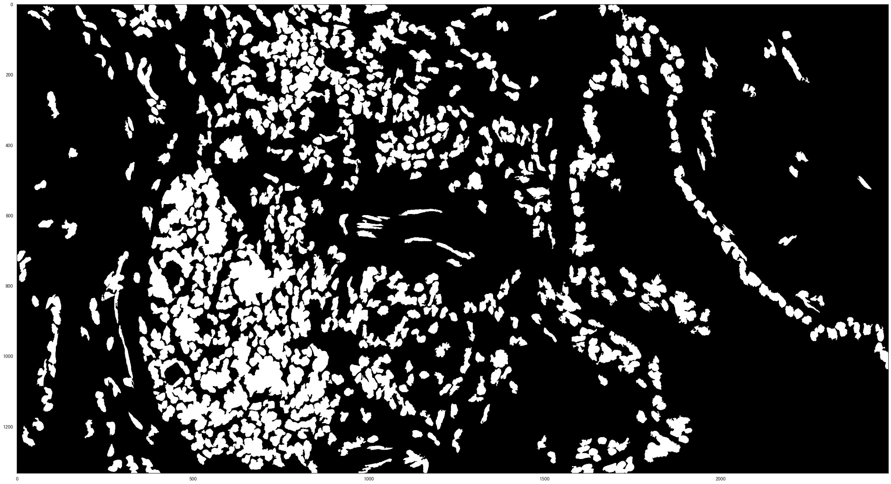

# 淋巴细胞识别

使用简单逻辑处理细胞识别问题
* 聚类抽取ROI
* 使用mask抽取ROI区域
* 在处理





## 聚类








`








### 分水岭


```python

```


```python

```

## 集成


### k = 4





    根据聚类结果筛选出最佳聚类图层
    close_cluster_index: 3


    根据图层找轮廓





    递归分水岭分割


### k = 6


```python

```

### k = 8


```python

```
